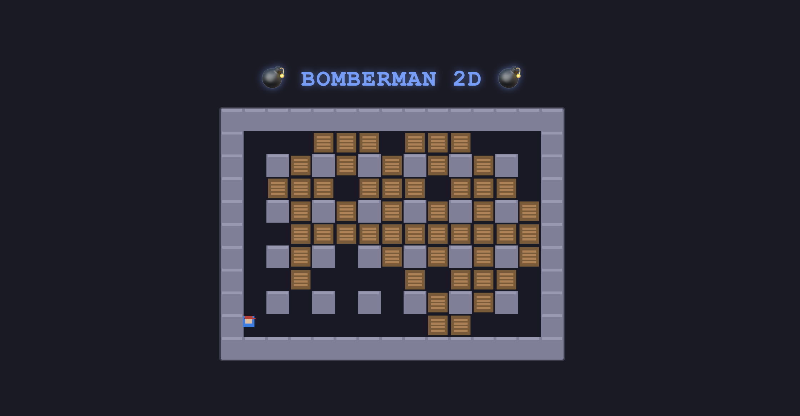

# 💣 BOMBERMAN 2D - Game Presentation

---

## Slide 1: Title

# 💣 BOMBERMAN 2D
### Classic Bombing Action Reborn

*A modern tribute to the classic arcade game, built with Rust and Bevy*

---

## Slide 2: The Game



*Clean visuals, smooth gameplay, instant action*

---

## Slide 3: What is Bomberman 2D?

**Bomberman 2D** is a modern web-based recreation of the classic arcade action game.

- **Genre**: Action / Strategy / Arcade
- **Platform**: Web browser (WebAssembly)
- **Style**: Retro-inspired with clean visuals
- **Experience**: Fast-paced strategic gameplay

---

## Slide 4: The Concept

**Place bombs. Destroy boxes. Outsmart the explosions.**

You control a character in a grid-based arena filled with:
- 🧱 **Indestructible walls** - Permanent barriers
- 📦 **Destructible boxes** - Blow them up for paths
- 💣 **Bombs** - Your weapon and your challenge

**Goal**: Navigate the arena, place bombs strategically, and survive the explosions!

---

## Slide 5: How It Works

### Core Mechanics

```
┌─────────────────────────┐
│ 1. Move your character  │
│    through the maze     │
│                         │
│ 2. Place bombs (max 3)  │
│    in strategic spots   │
│                         │
│ 3. Bombs explode after  │
│    2 seconds in a +     │
│    shape pattern        │
│                         │
│ 4. Escape the blast!    │
└─────────────────────────┘
```

---

## Slide 6: Explosion Mechanics

```
    ↑
    │ (2 tiles)
    │
← 💣 → (2 tiles each direction)
    │
    │ (2 tiles)
    ↓
```

**Explosion Rules:**
- **2-second timer** before explosion
- **2-tile range** in all 4 directions
- Destroys **boxes** but not **walls**
- **Don't get caught!** Respawn on death

---

## Slide 7: Features

| Feature | Description |
|---------|-------------|
| 🎮 **Smooth Controls** | WASD or Arrow Keys for movement |
| 💣 **Bomb Placement** | Space bar to place bombs |
| 🔄 **Respawn System** | Never truly game over |
| 🎨 **Clean Visuals** | Minimalist, easy-to-read graphics |
| ⚡ **Instant Play** | No downloads, runs in browser |
| 📱 **Responsive** | Works on any device with a keyboard |

---

## Slide 8: How to Play

### Controls

| Action | Keys |
|--------|------|
| Move Up | W / ↑ |
| Move Down | S / ↓ |
| Move Left | A / ← |
| Move Right | D / → |
| Place Bomb | Space / X |

### Tips
- 🎯 Plan your escape route before placing bombs
- 💥 Use explosions to clear paths through boxes
- 🏃 Keep moving - standing still is dangerous
- 🔄 You respawn instantly - keep trying!

---

## Slide 9: Technical Achievement

### Built with Modern Rust Tech Stack

```
┌─────────────────────────────────────┐
│           Bevy Game Engine          │
│      (Entity Component System)      │
└─────────────────────────────────────┘
              ↓
┌─────────────────────────────────────┐
│           Rust + WebAssembly        │
│    (Native performance in browser)  │
└─────────────────────────────────────┘
              ↓
┌─────────────────────────────────────┐
│         Deployed on Vercel          │
│     (Global edge network delivery)  │
└─────────────────────────────────────┘
```

---

## Slide 10: Why It's Special

### 🚀 Performance
- Runs at 60 FPS in your browser
- Zero install time - instant loading
- Small bundle size (~500KB)

### 🛠️ Tech Highlights
- **Rust** for memory safety and performance
- **Bevy ECS** for clean game architecture
- **WebAssembly** for near-native speed
- **Open Source** - Learn from the code

---

## Slide 11: Level Design

### Strategic Map Layout

- **15 × 11 tile grid**
- **Fixed walls** create maze structure
- **Destructible boxes** create strategic options
- **Safe zones** for spawning
- **Escape routes** always available

Every box destroyed = new possibilities!

---

## Slide 12: Development Journey

```
Idea → Design → Code → Playtest → Deploy
  ↓      ↓       ↓        ↓         ↓
Rust   Bevy   ECS    Iteration  Vercel
```

**Built in iterative cycles**:
- Core gameplay first
- Visual polish second
- Web deployment third
- Continuous improvements forever

---

## Slide 13: Play Now!

### 🎮 Start Playing

**Visit:** https://bomberman-2d.vercel.app/

**Or Run Locally:**
```bash
git clone https://github.com/firstnapat/bomberman-2d
cd bomberman-2d
npm install
npm run dev
```

---

## Slide 14: The Code

### Open Source & Learning Resource

Want to see how it's built?

```
📁 src/
├── main.rs    # Native entry point
├── lib.rs     # WASM entry point
└── game.rs    # All game logic
```

**Perfect for learning:**
- Rust game development
- Bevy ECS patterns
- WebAssembly deployment

---

## Slide 15: What's Next?

### Roadmap

- [ ] Multiplayer mode
- [ ] Power-ups (speed, bomb count, range)
- [ ] Multiple levels
- [ ] Enemy AI
- [ ] Score tracking
- [ ] Mobile touch controls

---

## Slide 16: Thank You!

# 💣 BOMBERMAN 2D

**Play now:** [Your Game URL]
**GitHub:** https://github.com/firstnapat/bomberman-2d

---

*Made with Rust + Bevy + ❤️*
